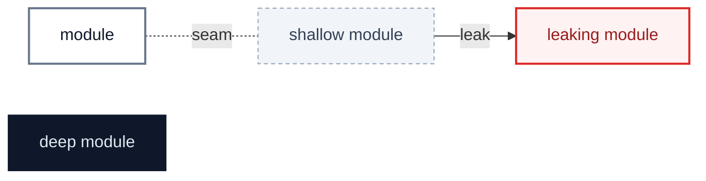
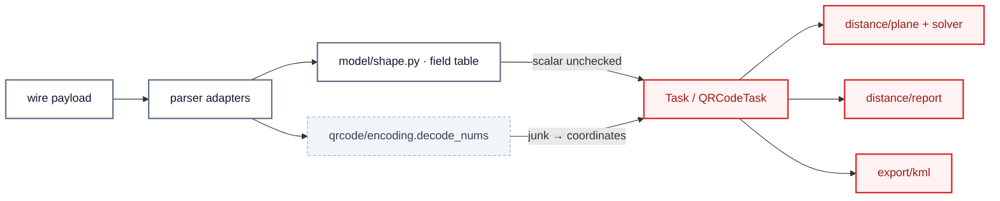
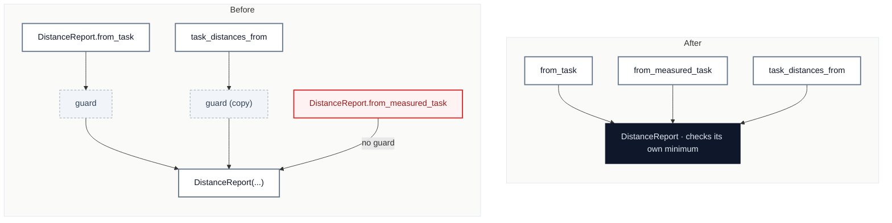
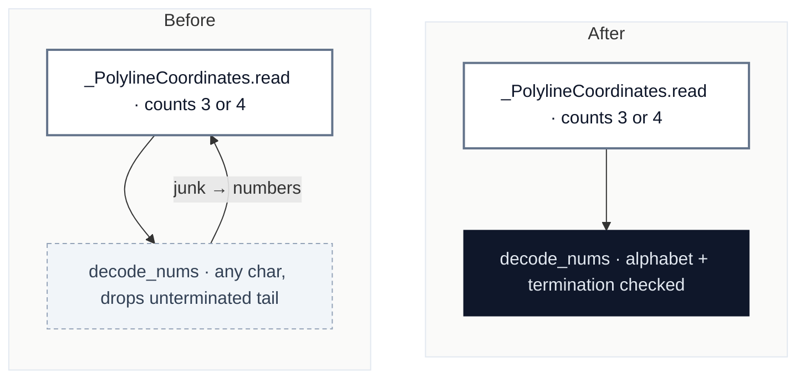
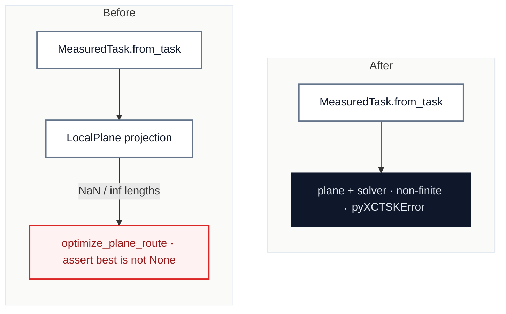
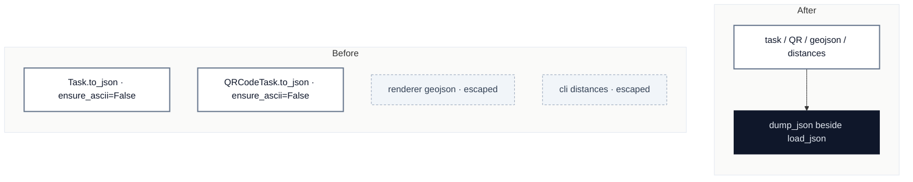
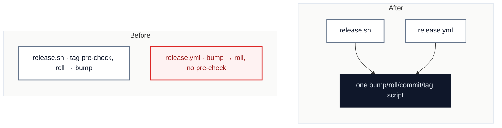

# pyxctsk: the field table checks containers, and nothing owns a scalar

`2026-10-02` · at `003f9c3` (`main`) · scope: all of `src/pyxctsk` (churn since the [2026-09-27](2026-09-27-deepening-candidates.md) review is release tooling plus `6b361c5`'s lenient radius in `model/shape.py`), and `scripts/release.sh`, `scripts/changelog_extract.py`, `scripts/task_viewer/api.py` · glossary: `CONTEXT.md` · ADRs read: 0001, 0002, 0003, 0004

**Jump to:** [Status](#status) · [Where it hurts](#where-it-hurts) · [C1](#c1--one-owner-for-a-wire-scalar) · [C2](#c2--the-distance-report-owns-the-two-turnpoint-minimum) · [C3](#c3--the-polyline-decoder-owns-its-own-validity) · [C4](#c4--the-solver-refuses-a-route-it-cannot-measure) · [C5](#c5--one-json-writer) · [C6](#c6--one-release-sequence) · [Smaller findings](#smaller-findings) · [Recommendation](#recommendation)

Legend

## Status

The backlog, in rank order. After the scan only three parts of this file change: this table, each candidate's **Decisions**, and **Departures**. The findings stay as found.

| ID | Deepening | Strength | Lens | Status | Branch | PR | Breaking | Notes |
|---|---|---|---|---|---|---|---|---|
| [C1](#c1--one-owner-for-a-wire-scalar) | One owner for a wire scalar | 🟢 Strong · 🔴 live defect | deepening | in-progress | `refactor/wire-scalars` | | | batch 2026-10-02: C1 → C2 → C3 → C4 |
| [C2](#c2--the-distance-report-owns-the-two-turnpoint-minimum) | The distance report owns the two-turnpoint minimum | 🟢 Strong · 🔴 live defect | deepening | todo | `refactor/report-owns-minimum` | | | |
| [C3](#c3--the-polyline-decoder-owns-its-own-validity) | The polyline decoder owns its own validity | 🟢 Strong · 🔴 live defect | deepening | todo | `refactor/polyline-decoder-validity` | | | |
| [C4](#c4--the-solver-refuses-a-route-it-cannot-measure) | The solver refuses a route it cannot measure | 🟢 Strong · 🔴 live defect | deepening | todo | `refactor/unmeasurable-route` | | | builds on C1 |
| [C5](#c5--one-json-writer) | One JSON writer | 🟡 Worth exploring | maintainability | todo | `refactor/one-json-writer` | | | |
| [C6](#c6--one-release-sequence) | One release sequence | 🟡 Worth exploring | maintainability | todo | `refactor/one-release-sequence` | | | |
| [S1](#s1--qr-tasktype-swallows-an-unknown-value) | QR `taskType` swallows an unknown value | — | maintainability | todo | rides with C1 | | | |
| [S2](#s2--the-qr-recognizer-decodes-twice-and-is-not-total) | The QR recognizer decodes twice and is not total | — | maintainability | todo | `refactor/smaller-findings-2026-10-02` | | | |
| [S3](#s3--kml-leaks-an-expaterror) | KML leaks an `ExpatError` | — | maintainability | todo | `refactor/smaller-findings-2026-10-02` | | | |
| [S4](#s4--timeofday-raises-two-types-and-wraps-its-message-twice) | `TimeOfDay` raises two types and wraps its message twice | — | maintainability | todo | `refactor/smaller-findings-2026-10-02` | | | |
| [S5](#s5--the-goal-default-is-applied-twice) | The goal default is applied twice | — | maintainability | todo | `refactor/smaller-findings-2026-10-02` | | | |
| [S6](#s6--four-hand-written-format-lists-all-missing-geojson) | Four hand-written format lists, all missing `geojson` | — | maintainability | todo | `refactor/smaller-findings-2026-10-02` | | | |
| [S7](#s7--changelog_extract-stops-at-any--heading) | `changelog_extract` stops at any `## ` heading | — | maintainability | todo | rides with C6 | | | |
| [S8](#s8--task_viewer-guards-an-import-that-cannot-fail) | `task_viewer` guards an import that cannot fail | — | maintainability | todo | `refactor/smaller-findings-2026-10-02` | | | |

Strength: 🟢 Strong · 🟡 Worth exploring · ⚪ Speculative · 🔴 live defect (a bug reproduced during the scan).
Status: `todo` · `in-progress` · `pr-open` · `merged` · `blocked` · `dropped`. `blocked` and `dropped` always carry a reason in Notes.

## Where it hurts

Every red module is where a malformed scalar that the field table let through finally fails, as a traceback or a silent wrong number. The 2026-09-27 review made the table refuse a wrong *container*; `6b361c5` then widened one scalar codec by hand, and the same week's churn shows the pattern repeating.

## Since the last review

- `2026-09-27` — all eight candidates and eight smaller findings merged in #22. Candidate 2 (the field table trusted wire types) is extended here by C1, from containers to scalars.

---

## C1 · One owner for a wire scalar

🟢 **Strong** · 🔴 **live defect** · `in-process` · builds on: —

`src/pyxctsk/model/shape.py:62,163-221` · `src/pyxctsk/model/task.py:111-115,174,384,586` · `src/pyxctsk/qrcode/models.py:107,349-362` · `src/pyxctsk/qrcode/task.py:462,472`

```mermaid
flowchart LR
  subgraph before["Before"]
    direction TB
    R1["Value row"]:::module --> I1["IDENTITY · lat, lon, name, version, fa"]:::leak
    R1 --> RI1["ROUNDED_INT · str→float, bool ok"]:::shallow
    R1 --> LI1["LENIENT_INT · str→int, 2.0 refused"]:::shallow
    R1 --> WI1["wire_int_codec · bool refused"]:::shallow
    I1 -- "leak" --> D1["plane.py / report.py / validation.py"]:::leak
    RI1 -- "OverflowError" --> D1
  end
  subgraph after["After"]
    direction TB
    R2["Value row"]:::module --> S2["wire scalars · number, whole metre, integer, coordinate, text"]:::deep
    subgraph absorbed[" "]
      direction TB
      F2["finite"]:::faded
      B2["not a bool"]:::faded
      N2["numeric string"]:::faded
      T2["valid text"]:::faded
    end
    S2 -.- absorbed
  end
  before ~~~ after
  classDef module fill:#ffffff,stroke:#64748b,stroke-width:2px,color:#0f172a
  classDef shallow fill:#f1f5f9,stroke:#94a3b8,stroke-dasharray:4 3,color:#334155
  classDef deep fill:#0f172a,stroke:#0f172a,color:#e2e8f0
  classDef faded fill:#1e293b,stroke:#475569,color:#94a3b8
  classDef leak fill:#fef2f2,stroke:#dc2626,stroke-width:2px,color:#991b1b
  style absorbed fill:#0f172a,stroke:#0f172a
  style before fill:#fafaf9,stroke:#e2e8f0
  style after fill:#fafaf9,stroke:#e2e8f0
```

> [!CAUTION]
> **Live defect:** on a two-turnpoint task, `"radius":"inf"` (or `1e400`) → `OverflowError` traceback from every command; `"lat":"46"` → `TypeError` in `plane.py` from `distances`; `"lat":true` → exit 0, `task_distance_m` 4 996 226 m, the turnpoint read as 1°N; `"name":123` → `ValueError: Unknown format code 's'` from `distances --format text`; `"name":"\ud800"` → `UnicodeEncodeError` from `convert`; full-format `"version":"1"` under `--strict` → `this format defines version 1, the task declares 1`.

| Problem | Solution | Wins |
|---|---|---|
| "A number on the wire" is answered four ways (`IDENTITY`, `ROUNDED_INT`, `LENIENT_INT`, `wire_int_codec`) and "text on the wire" not at all, so a bad scalar parses and fails downstream, and `_READ_ERRORS` is again a list of whichever built-ins leaked (`OverflowError` is missing). | Give `shape.py` one family of scalar codecs that every row reads through, so a bad scalar becomes a `MalformedPayloadError` with its path. | locality: one rule per scalar kind leverage: every row checked downstream modules trust the model `_READ_ERRORS` stops growing |

Decisions

---

## C2 · The distance report owns the two-turnpoint minimum

🟢 **Strong** · 🔴 **live defect** · `in-process` · builds on: —

`src/pyxctsk/distance/report.py:43-51,156-170` · `src/pyxctsk/distance/task_distances.py:180-181`

> [!CAUTION]
> **Live defect:** a one-turnpoint task → `DistanceReport.from_measured_task(MeasuredTask.from_task(t)).task_distance_m` is `0.0`, no error — the answer `report.py:48-51` says the rule's single owner exists to prevent. `DistanceReport.from_task(t)` raises `TooFewTurnpointsError`.

| Problem | Solution | Wins |
|---|---|---|
| The rule documented as having one owner is two copies at two entry points, and the third public entry point has neither. | The report's constructor enforces the minimum; the entry-point copies go. | locality: rule in one place no entry point bypasses it |

Decisions

---

## C3 · The polyline decoder owns its own validity

🟢 **Strong** · 🔴 **live defect** · `in-process` · builds on: —

`src/pyxctsk/qrcode/encoding.py:88-116` · `src/pyxctsk/qrcode/models.py:281-305`

> [!CAUTION]
> **Live defect:** `XCTSK:{…"t":[{"n":"A","z":"1234"},{"n":"B","z":"_d{r@_fn~Go}@_"}]}` → exit 0; A is lat −0.0001, lon 0.00009, radius −11 (junk read as coordinates in the Gulf of Guinea, which the `from_dict` docstring says the format refuses), and B, whose fourth number was truncated, is read as a radius-0 waypoint.

| Problem | Solution | Wins |
|---|---|---|
| `decode_nums` accepts characters outside the polyline alphabet and silently drops an unterminated final number, so the only check its caller can make — three or four numbers — passes on garbage. | The decoder refuses a character outside 63–126 and an unterminated final number. | locality: encoding rules in the codec no invented coordinates |

Decisions

---

## C4 · The solver refuses a route it cannot measure

🟢 **Strong** · 🔴 **live defect** · `in-process` · builds on: C1

`src/pyxctsk/distance/solver.py:308-322` · `src/pyxctsk/distance/plane.py`

> [!CAUTION]
> **Live defect:** two radius-0 turnpoints at (0, 0) and (0, 180) — valid by `Task.validate()` — → bare `AssertionError` from `pyxctsk distances`, `convert --format kml` and `--format geojson`. `"lat":95` reaches the same assert. The comment on it says it cannot fire (`_INITIAL_PLACEMENTS is never empty`).

| Problem | Solution | Wins |
|---|---|---|
| A task the local Transverse Mercator plane cannot represent produces non-finite candidate lengths, and the solver reports it as an assertion about its own placements. | The plane/solver seam refuses a non-finite projection with a library error naming the cause; C1 already refuses out-of-range coordinates at read. | error mode in the interface CLI reports, not traceback |

> [!NOTE]
> ADR 0001: the Ding–Xie–Jiang solver is kept as is; only its failure mode changes.

Decisions

---

## C5 · One JSON writer

🟡 **Worth exploring** · `in-process` · builds on: —

`src/pyxctsk/renderer.py:63` · `src/pyxctsk/cli.py:269` · `src/pyxctsk/model/task.py:500` · `src/pyxctsk/qrcode/task.py:217` · `src/pyxctsk/model/shape.py` (`load_json`)

Four `json.dumps` call sites choose their own options: a waypoint named `Château` is written as-is by `json` and `qrcode-json`, and as `Château` by `geojson` and `distances`.

| Problem | Solution | Wins |
|---|---|---|
| Reading JSON has one owner (`load_json`); writing has four, and the 2026-09-27 fix for non-ASCII reached two of them. | One writer beside the reader; every JSON output goes through it. | locality: output options in one place four outputs agree |

Decisions

---

## C6 · One release sequence

🟡 **Worth exploring** · `local-substitutable` · builds on: —

`scripts/release.sh:44-71` · `.github/workflows/release.yml:55-86`

`842eb6e`'s origin-tag pre-check landed in `release.sh` only; the two run roll and bump in opposite orders, and `release.sh` bumps twice (`--dry-run` at `:44`, for real at `:66`) with the tree already dirty between them.

| Problem | Solution | Wins |
|---|---|---|
| The release sequence is written twice and the two copies have already drifted. | Both paths call one script that applies the version it computed once. | locality: a release fix lands once no half-applied tree |

Decisions

---

## Smaller findings

### S1 · QR `taskType` swallows an unknown value

`src/pyxctsk/qrcode/task.py:352` · rides with C1

`_CompetitionTaskType.read` maps anything but `CLASSIC`/`WAYPOINTS`/`W` to absent, so `XCTSK:{"taskType":"FOO",…}` is re-written as `"taskType":"CLASSIC"` with the value lost, where the full format refuses `'FOO' is not a valid TaskType`. Refuse it the same way.

### S2 · The QR recognizer decodes twice and is not total

`src/pyxctsk/parser.py:197-204` · rides with `refactor/smaller-findings-2026-10-02`

`_qr_url_text` re-decodes `inp.raw` strictly after `Input.of` already found it not UTF-8, so `printf 'XCTSK:\xff' | pyxctsk convert` prints a `UnicodeDecodeError` traceback from a recognizer documented as total. Recognize on the byte prefix and let the reader raise `InvalidFormatError` when `inp.text is None`.

### S3 · KML leaks an `ExpatError`

`src/pyxctsk/export/kml.py:204` · rides with `refactor/smaller-findings-2026-10-02`

A waypoint name holding a control character (`"a\u0001"`, valid JSON) makes `convert --format kml` crash with simplekml's `xml.parsers.expat.ExpatError`, outside the `pyXCTSKError` hierarchy the CLI catches. Characters XML 1.0 cannot carry need handling before the text reaches simplekml.

### S4 · `TimeOfDay` raises two types and wraps its message twice

`src/pyxctsk/model/time_of_day.py:32-36,71` · rides with `refactor/smaller-findings-2026-10-02`

`__post_init__` raises a bare `ValueError` while its parser raises `InvalidTimeOfDayError`, and the latter's message reads `invalid time: 'Invalid time string: 12:00Z'`. One error type, one message prefix.

### S5 · The goal default is applied twice

`src/pyxctsk/distance/measured_task.py:71` · `src/pyxctsk/model/task.py:432-451` · rides with `refactor/smaller-findings-2026-10-02`

`task_to_turnpoints` re-applies `goal.type or GoalType.CYLINDER` after `effective_goal` already guaranteed a type, and `effective_goal`'s docstring names the QR conversion as a user while `qrcode/conversion.py` deliberately reads `task.goal`. Trust the guarantee and correct the docstring.

### S6 · Four hand-written format lists, all missing `geojson`

`README.md:197-202` · `CLAUDE.md:47` · `src/pyxctsk/cli.py:8,182,188` · rides with `refactor/smaller-findings-2026-10-02`

`renderer.OUTPUT_FORMATS` is the one table of formats, yet the README, CLAUDE.md and two `cli.py` docstrings restate the list and each omits `geojson`, which `--help` shows. Point at the table or `--help`, and add `geojson` where a list stays.

### S7 · `changelog_extract` stops at any `## ` heading

`scripts/changelog_extract.py:8-9,43,87` · rides with C6

The docstring says a section runs to the next `## [` heading; the code stops at any `## ` line, so a `## Migration` subsection is cut from the release notes. Match on `## [`.

### S8 · `task_viewer` guards an import that cannot fail

`scripts/task_viewer/api.py:8-20,121,155` · rides with `refactor/smaller-findings-2026-10-02`

`XCTRACK_AVAILABLE` guards importing pyxctsk inside a tool that exists to display it, costs seven `# type: ignore`, and is checked in two of the three routes that need it. Import unconditionally and delete the flag.

## Recommendation

> [!IMPORTANT]
> **Start with [C1 · One owner for a wire scalar](#c1--one-owner-for-a-wire-scalar)** — it removes the most tracebacks and silent wrong numbers, and C4 builds on it.
>
> **Proposed batch** (every 🟢 Strong, in order): C1 → C2 → C3 → C4

## Departures

<!-- filled during implementation: where a PR deliberately differs from this report, and why -->
