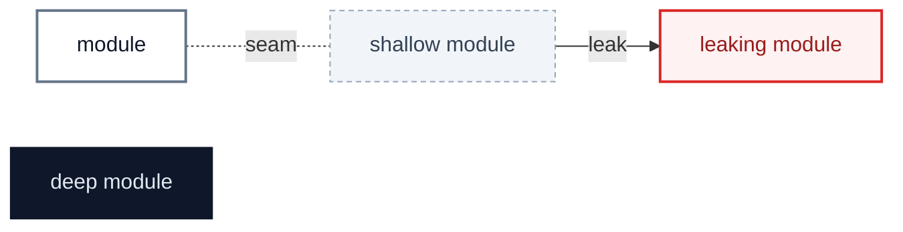
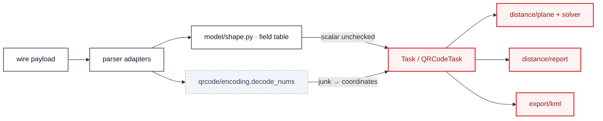
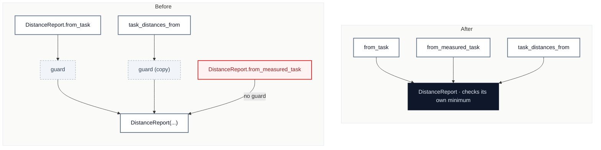
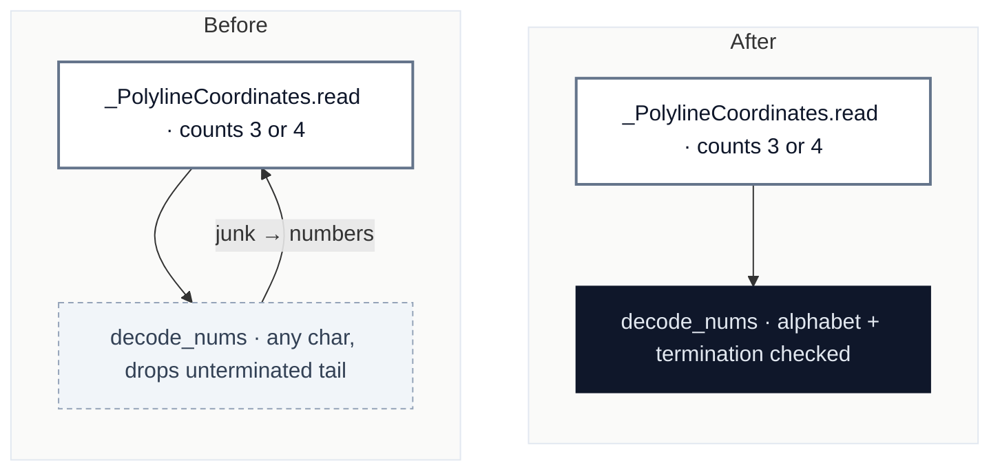
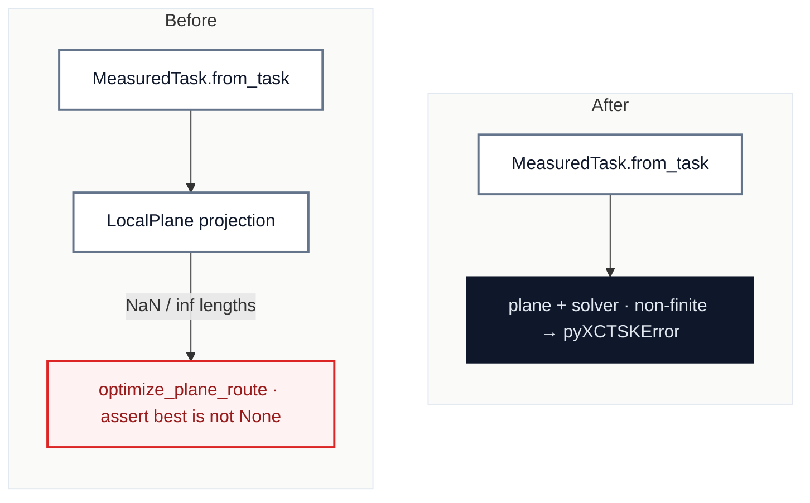
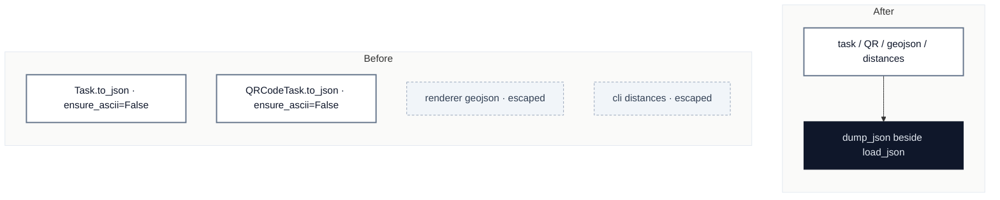
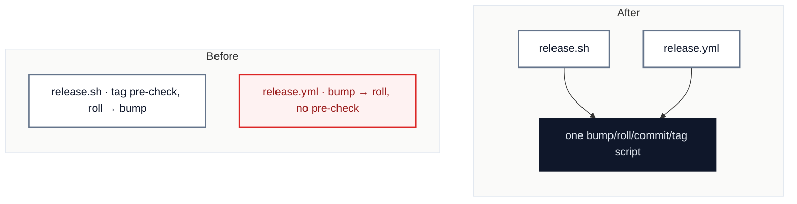

# pyxctsk: the field table checks containers, and nothing owns a scalar

`2026-10-02` · at `003f9c3` (`main`) · scope: all of `src/pyxctsk` (churn since the [2026-09-27](2026-09-27-deepening-candidates.md) review is release tooling plus `6b361c5`'s lenient radius in `model/shape.py`), and `scripts/release.sh`, `scripts/changelog_extract.py`, `scripts/task_viewer/api.py` · glossary: `CONTEXT.md` · ADRs read: 0001, 0002, 0003, 0004

**Jump to:** [Status](#status) · [Where it hurts](#where-it-hurts) · [C1](#c1--one-owner-for-a-wire-scalar) · [C2](#c2--the-distance-report-owns-the-two-turnpoint-minimum) · [C3](#c3--the-polyline-decoder-owns-its-own-validity) · [C4](#c4--the-solver-refuses-a-route-it-cannot-measure) · [C5](#c5--one-json-writer) · [C6](#c6--one-release-sequence) · [Smaller findings](#smaller-findings) · [Recommendation](#recommendation)

Legend

## Status

The backlog, in rank order. After the scan only three parts of this file change: this table, each candidate's **Decisions**, and **Departures**. The findings stay as found.

| ID | Deepening | Strength | Lens | Status | Branch | PR | Breaking | Notes |
|---|---|---|---|---|---|---|---|---|
| [C1](#c1--one-owner-for-a-wire-scalar) | One owner for a wire scalar | 🟢 Strong · 🔴 live defect | deepening | pr-open | `refactor/wire-scalars` | [#29](https://github.com/simonsteiner/pyxctsk/pull/29) | yes | batch 2026-10-02: C1 → C2 → C3 → C4 |
| [C2](#c2--the-distance-report-owns-the-two-turnpoint-minimum) | The distance report owns the two-turnpoint minimum | 🟢 Strong · 🔴 live defect | deepening | pr-open | `refactor/report-owns-minimum` | [#30](https://github.com/simonsteiner/pyxctsk/pull/30) | no | |
| [C3](#c3--the-polyline-decoder-owns-its-own-validity) | The polyline decoder owns its own validity | 🟢 Strong · 🔴 live defect | deepening | pr-open | `refactor/polyline-decoder-validity` | [#31](https://github.com/simonsteiner/pyxctsk/pull/31) | no | |
| [C4](#c4--the-solver-refuses-a-route-it-cannot-measure) | The solver refuses a route it cannot measure | 🟢 Strong · 🔴 live defect | deepening | pr-open | `refactor/unmeasurable-route` | [#32](https://github.com/simonsteiner/pyxctsk/pull/32) | no | builds on C1 |
| [C5](#c5--one-json-writer) | One JSON writer | 🟡 Worth exploring | maintainability | todo | `refactor/one-json-writer` | | | |
| [C6](#c6--one-release-sequence) | One release sequence | 🟡 Worth exploring | maintainability | todo | `refactor/one-release-sequence` | | | |
| [S1](#s1--qr-tasktype-swallows-an-unknown-value) | QR `taskType` swallows an unknown value | — | maintainability | pr-open | rides with C1 (`refactor/wire-scalars`) | [#29](https://github.com/simonsteiner/pyxctsk/pull/29) | yes | |
| [S2](#s2--the-qr-recognizer-decodes-twice-and-is-not-total) | The QR recognizer decodes twice and is not total | — | maintainability | pr-open | `refactor/smaller-findings-2026-10-02` | [#33](https://github.com/simonsteiner/pyxctsk/pull/33) | no | |
| [S3](#s3--kml-leaks-an-expaterror) | KML leaks an `ExpatError` | — | maintainability | pr-open | `refactor/smaller-findings-2026-10-02` | [#33](https://github.com/simonsteiner/pyxctsk/pull/33) | no | |
| [S4](#s4--timeofday-raises-two-types-and-wraps-its-message-twice) | `TimeOfDay` raises two types and wraps its message twice | — | maintainability | pr-open | `refactor/smaller-findings-2026-10-02` | [#33](https://github.com/simonsteiner/pyxctsk/pull/33) | no | |
| [S5](#s5--the-goal-default-is-applied-twice) | The goal default is applied twice | — | maintainability | pr-open | `refactor/smaller-findings-2026-10-02` | [#33](https://github.com/simonsteiner/pyxctsk/pull/33) | no | |
| [S6](#s6--four-hand-written-format-lists-all-missing-geojson) | Four hand-written format lists, all missing `geojson` | — | maintainability | pr-open | `refactor/smaller-findings-2026-10-02` | [#33](https://github.com/simonsteiner/pyxctsk/pull/33) | no | |
| [S7](#s7--changelog_extract-stops-at-any---heading) | `changelog_extract` stops at any `## ` heading | — | maintainability | todo | rides with C6 | | | |
| [S8](#s8--task_viewer-guards-an-import-that-cannot-fail) | `task_viewer` guards an import that cannot fail | — | maintainability | pr-open | `refactor/smaller-findings-2026-10-02` | [#33](https://github.com/simonsteiner/pyxctsk/pull/33) | no | |
| [S9](#s9--a-negative-radius-is-reported-as-a-mismatched-route) | A negative radius is reported as a mismatched route | — | maintainability | pr-open | `refactor/smaller-findings-2026-10-02` | [#33](https://github.com/simonsteiner/pyxctsk/pull/33) | no | found in C1 and C3 |
| [S10](#s10--a-qr-turnpoint-type-refuses-a-numeric-string) | A QR turnpoint type refuses a numeric string | — | maintainability | pr-open | `refactor/smaller-findings-2026-10-02` | [#33](https://github.com/simonsteiner/pyxctsk/pull/33) | no | found in C1 |
| [S11](#s11--centre-distance-restates-the-two-turnpoint-minimum) | Centre distance restates the two-turnpoint minimum | — | maintainability | pr-open | `refactor/smaller-findings-2026-10-02` | [#33](https://github.com/simonsteiner/pyxctsk/pull/33) | no | found in C2 |
| [S12](#s12--the-solver-warns-before-the-plane-refuses) | The solver warns before the plane refuses | — | maintainability | dropped | `refactor/smaller-findings-2026-10-02` | | | found in C4; does not reproduce on the stack top: no OptimizeWarning from the CLI or the library under -W always (checked 2026-10-02) |

Strength: 🟢 Strong · 🟡 Worth exploring · ⚪ Speculative · 🔴 live defect (a bug reproduced during the scan).
Status: `todo` · `in-progress` · `pr-open` · `merged` · `blocked` · `dropped`. `blocked` and `dropped` always carry a reason in Notes.

## Where it hurts

Every red module is where a malformed scalar that the field table let through finally fails, as a traceback or a silent wrong number. The 2026-09-27 review made the table refuse a wrong *container*; `6b361c5` then widened one scalar codec by hand, and the same week's churn shows the pattern repeating.

## Since the last review

- `2026-09-27` — all eight candidates and eight smaller findings merged in #22. Candidate 2 (the field table trusted wire types) is extended here by C1, from containers to scalars.

---

## C1 · One owner for a wire scalar

🟢 **Strong** · 🔴 **live defect** · `in-process` · builds on: —

`src/pyxctsk/model/shape.py:62,163-221` · `src/pyxctsk/model/task.py:111-115,174,384,586` · `src/pyxctsk/qrcode/models.py:107,349-362` · `src/pyxctsk/qrcode/task.py:462,472`

```mermaid
flowchart LR
  subgraph before["Before"]
    direction TB
    R1["Value row"]:::module --> I1["IDENTITY · lat, lon, name, version, fa"]:::leak
    R1 --> RI1["ROUNDED_INT · str→float, bool ok"]:::shallow
    R1 --> LI1["LENIENT_INT · str→int, 2.0 refused"]:::shallow
    R1 --> WI1["wire_int_codec · bool refused"]:::shallow
    I1 -- "leak" --> D1["plane.py / report.py / validation.py"]:::leak
    RI1 -- "OverflowError" --> D1
  end
  subgraph after["After"]
    direction TB
    R2["Value row"]:::module --> S2["wire scalars · number, whole metre, integer, coordinate, text"]:::deep
    subgraph absorbed[" "]
      direction TB
      F2["finite"]:::faded
      B2["not a bool"]:::faded
      N2["numeric string"]:::faded
      T2["valid text"]:::faded
    end
    S2 -.- absorbed
  end
  before ~~~ after
  classDef module fill:#ffffff,stroke:#64748b,stroke-width:2px,color:#0f172a
  classDef shallow fill:#f1f5f9,stroke:#94a3b8,stroke-dasharray:4 3,color:#334155
  classDef deep fill:#0f172a,stroke:#0f172a,color:#e2e8f0
  classDef faded fill:#1e293b,stroke:#475569,color:#94a3b8
  classDef leak fill:#fef2f2,stroke:#dc2626,stroke-width:2px,color:#991b1b
  style absorbed fill:#0f172a,stroke:#0f172a
  style before fill:#fafaf9,stroke:#e2e8f0
  style after fill:#fafaf9,stroke:#e2e8f0
```

> [!CAUTION]
> **Live defect:** on a two-turnpoint task, `"radius":"inf"` (or `1e400`) → `OverflowError` traceback from every command; `"lat":"46"` → `TypeError` in `plane.py` from `distances`; `"lat":true` → exit 0, `task_distance_m` 4 996 226 m, the turnpoint read as 1°N; `"name":123` → `ValueError: Unknown format code 's'` from `distances --format text`; `"name":"\ud800"` → `UnicodeEncodeError` from `convert`; full-format `"version":"1"` under `--strict` → `this format defines version 1, the task declares 1`.

| Problem | Solution | Wins |
|---|---|---|
| "A number on the wire" is answered four ways (`IDENTITY`, `ROUNDED_INT`, `LENIENT_INT`, `wire_int_codec`) and "text on the wire" not at all, so a bad scalar parses and fails downstream, and `_READ_ERRORS` is again a list of whichever built-ins leaked (`OverflowError` is missing). | Give `shape.py` one family of scalar codecs that every row reads through, so a bad scalar becomes a `MalformedPayloadError` with its path. | locality: one rule per scalar kind leverage: every row checked downstream modules trust the model `_READ_ERRORS` stops growing |

Decisions

- Q1 — Where does a scalar's rule live, and behind what seam? → as module-level `Codec` values in `model/shape.py` beside `list_codec` and `enum_codec`, raising `MalformedPayloadError`; no new seam, because `Value.read` already sends every value through `codec.from_wire` inside `_read_at`, which attaches the path — `turnpoints[1].radius: expected a finite number, got 'inf'` came out with no change to the traversal.
- Q2 — Which kinds? → `NUMBER`, `WHOLE_METRES`, `INTEGER`, `LATITUDE`, `LONGITUDE`, `TEXT`, because those six cover every scalar `Value` row in both formats (`grep 'Value("'` over `src/`: names and descriptions are text, `lat`/`lon` coordinates, `radius`/`altSmoothed` whole metres, `version`/`V` and the five wire-integer tables integers, `finishAltitude`/`fa` a number); time-of-day and enums already had a single owner each.
- Q3 — Does `Value` keep a pass-through default codec? → no: `codec` is required and `IDENTITY` is deleted, because the ten rows that relied on the default (full: `name`, `lat`, `lon`, `description`, `version`, `finishAltitude`; QR: `fa`, `d`, two `n`) are exactly the ten unchecked scalars behind the card's reproductions.
- Q4 — Is a number spelled as a string accepted, and for which kinds? → for every number kind, written back as a number, and `wire_int_codec`'s `lenient=` flag is deleted, because Burnair's `"radius": "700"` (`tests/model/test_task.py`) and the QR `version`/`e` strings (read by `int(str(...))` before `447e294`) are the real-world precedents, and a per-row flag is the drift being removed. `"lat": "46"` used to parse and raise `TypeError` in `plane.py`; it now reads as 46. "Spelled as a string" means JSON's own number grammar, not Python's `int()`/`float()`, which also read `" 700 "`, `"1_000"` and `"٣"` (Arabic-Indic three) — found in review.
- Q5 — Does `NUMBER` normalize `int` to `float`? → no, JSON's int/float is kept, because the corpus is written back byte-for-byte: `pyxctsk convert` (json, qrcode-json, `-z`) and `distances` (json, text) over all 26 `.xctsk` files under `tests/data/reference_tasks` and the 24 expected QR strings — 178 outputs — are identical to the base branch.
- Q6 — Is a JSON boolean a number? → never, for any kind, because `"lat": true` was read as 1°N and reported a 4 996 226 m task with exit 0, and `ROUNDED_INT` accepted `true` as 1.
- Q7 — What counts as finite? → whatever a float can hold: `NaN`, `Infinity` (which Python's `json` reads) and an integer beyond float range are refused, because `"inf"` and `1e400` escaped as `OverflowError` from every command and `math.isfinite(10**400)` itself raises `OverflowError`.
- Q8 — Are coordinates range-checked at read? → yes, closed `[-90, 90]` and `[-180, 180]`, and the QR `z` row applies the same two codecs to what it decodes, because `"lat": 95` reaches the solver's `assert` (C4's reproduction, whose card says C1 refuses it) and every corpus coordinate is in range (golden outputs identical).
- Q9 — Is `2.0` an integer? → yes, read as `2` and so written back as `2`, because before C1 only `LENIENT_INT` (the QR root `version` and `e`) refused it: the full format's `version` was `IDENTITY` and every other `wire_int_codec` row accepted `2.0` (`2.0 in inverse`), and a producer holding a double writes `1.0`. Found in review of #29, which first refused it. `2.5` is refused.
- Q10 — Is a non-string name coerced to text? → refused, not coerced, because `str(123)` would quietly change the value round-tripped; a lone surrogate is refused because `convert` raised `UnicodeEncodeError` writing it. Control characters stay text here: they are valid JSON and UTF-8, and only KML refuses them (S3).
- Q11 — The full-format `version`? → `INTEGER`, because `"version": "1"` under `--strict` reported `this format defines version 1, the task declares 1`; it now reads as 1 and `version: true` is refused rather than written back as `true`.
- Q12 — S1: what does an unknown QR `taskType` do? → raise `'FOO' is not a valid TaskType`, the full format's wording; `null` stays absent, because all 60 `taskType` values in `tests/data` are `CLASSIC` (`grep -oE '"taskType": ?"[^"]*"'`), so no real input changes, and the value was being lost on re-write.
- Q13 — Does `_READ_ERRORS` change? → no: `OverflowError` is not added, because the scalar codecs raise `MalformedPayloadError` themselves; a sweep of 24 scalar paths × 14 bad values (336 parses, both formats, QR `z` included) shows every input is either refused at read or survives json, qrcode-json, kml, geojson and the distance report.
- Q14 — Dependency category and test surface? → `in-process`; tests at the parser interface (`tests/conformance/test_parser_diagnostics.py`: the card's six reproductions, S1, and the sweep) plus the six rules at the codec interface (`tests/model/test_shape.py`); the `IDENTITY`/`ROUNDED_INT`/`LENIENT_INT` tests are replaced, because those codecs are gone.
- Q15 — One-way door? → no: no key, spelling or default the library writes changes (golden outputs identical); what changes is reading — values that crashed or were silently wrong are refused, and numeric strings in more places are read as numbers. Breaking for the `model.shape` API (three codecs and `lenient=` removed, `Value` needs a codec) and for inputs such as `"name": 123` that `convert` used to pass through.

---

## C2 · The distance report owns the two-turnpoint minimum

🟢 **Strong** · 🔴 **live defect** · `in-process` · builds on: —

`src/pyxctsk/distance/report.py:43-51,156-170` · `src/pyxctsk/distance/task_distances.py:180-181`

> [!CAUTION]
> **Live defect:** a one-turnpoint task → `DistanceReport.from_measured_task(MeasuredTask.from_task(t)).task_distance_m` is `0.0`, no error — the answer `report.py:48-51` says the rule's single owner exists to prevent. `DistanceReport.from_task(t)` raises `TooFewTurnpointsError`.

| Problem | Solution | Wins |
|---|---|---|
| The rule documented as having one owner is two copies at two entry points, and the third public entry point has neither. | The report's constructor enforces the minimum; the entry-point copies go. | locality: rule in one place no entry point bypasses it |

Decisions

- Q1 — Does the minimum belong on `DistanceReport` or on `MeasuredTask`? → on `DistanceReport`, because `MeasuredTask` is what `TaskDrawing` measures for `convert --format kml`/`geojson`, and a one-turnpoint task converts to both with exit 0 (`tests/export/test_kml.py::test_task_to_kml_single_turnpoint`, `tests/test_cli.py`'s one-turnpoint format tests, and a manual `convert` of a one-turnpoint file on both branches, byte-identical); `test_a_task_with_no_turnpoints_measures_to_nothing` already pins `MeasuredTask` as total — the pair, not the verdict.
- Q2 — In each constructor classmethod, or in `__post_init__`? → `__post_init__`, because a report has three ways in — `from_task`, `from_measured_task` and the dataclass constructor — and the red test refused in only two of six cases: `from_measured_task` and `DistanceReport(measured=...)`, on zero and one turnpoints, all returned a report with `task_distance_m == 0.0`. Only the constructor is common to all three.
- Q3 — Does `from_task` still check before it measures? → yes, through the same private `_require_distance` that `__post_init__` calls, so the rule keeps one owner. The first version measured and constructed, reasoning that `MeasuredTask.from_task` is total on zero and one turnpoints (Q1); review of #30 found that measuring can still fail first — a one-turnpoint task with `"radius": -5` reported `route point 0 is 5.0 m outside turnpoint 0's cylinder` instead of the minimum. Counting is free, so it comes first, and `pyxctsk distances` on a one-turnpoint file prints the same message with exit 1 on both branches.
- Q4 — `task_distances_from`'s copy of the guard? → deleted, with its imports of `MIN_TURNPOINTS_FOR_DISTANCE`, `TOO_FEW_TURNPOINTS_MESSAGE` and `TooFewTurnpointsError`, because its only path to a table is `DistanceReport.from_measured_task`, which now raises; the comparisons against `MIN_TURNPOINTS_FOR_DISTANCE` in `src/` fall from two (`report.py:156`, `task_distances.py:180`) to one, in `DistanceReport.__post_init__`.
- Q5 — `from_measured_task` is now the constructor spelled differently: delete it? → keep it, because `GoalLine.from_measured_task` and `SpeedSection.from_measured_task` name the same construction in the two sibling modules, it is reachable as `pyxctsk.DistanceReport.from_measured_task`, and deleting it would break the API while removing no concept; it gains the `Raises:` it lacked.
- Q6 — Which tests survive? → `tests/distance/test_report.py::TestTooFewTurnpoints` becomes one test over the three ways in × zero and one turnpoints, plus the two-turnpoint boundary, replacing three `from_task`-only tests; `test_task_distances.py`'s refusal test keeps the two table entry points and drops its `DistanceReport.from_task` case, now pinned in `test_report.py`; `test_measured_task.py` is unchanged, because it pins Q1.
- Q7 — Dependency category? → `in-process`: pure computation over a value, tested at the `DistanceReport` interface.
- Q8 — One-way door, breaking? → neither: `pyxctsk distances` (json, text) and `convert` (json, kml, geojson) over all 26 `.xctsk` files under `tests/data/reference_tasks` — 130 outputs — are byte-identical to `refactor/wire-scalars`; the only behaviour that changes is two entry points refusing what `TooFewTurnpointsError` is documented to refuse, instead of reporting 0.0 m.

---

## C3 · The polyline decoder owns its own validity

🟢 **Strong** · 🔴 **live defect** · `in-process` · builds on: —

`src/pyxctsk/qrcode/encoding.py:88-116` · `src/pyxctsk/qrcode/models.py:281-305`

> [!CAUTION]
> **Live defect:** `XCTSK:{…"t":[{"n":"A","z":"1234"},{"n":"B","z":"_d{r@_fn~Go}@_"}]}` → exit 0; A is lat −0.0001, lon 0.00009, radius −11 (junk read as coordinates in the Gulf of Guinea, which the `from_dict` docstring says the format refuses), and B, whose fourth number was truncated, is read as a radius-0 waypoint.

| Problem | Solution | Wins |
|---|---|---|
| `decode_nums` accepts characters outside the polyline alphabet and silently drops an unterminated final number, so the only check its caller can make — three or four numbers — passes on garbage. | The decoder refuses a character outside 63–126 and an unterminated final number. | locality: encoding rules in the codec no invented coordinates |

Decisions

- Q1 — Does the reproduction still slip through on C1's base? → yes, all of it, because on `refactor/report-owns-minimum` the card's payload parses with exit 0 to A at lat −0.0001, lon 0.00009, radius −11 and B as a radius-0 waypoint: C1's `LATITUDE`/`LONGITUDE`/`WHOLE_METRES` check the decoded numbers' range, and junk decodes to small in-range numbers. A third case surfaced: `"z": ["?", "?", "?"]` was iterated like a string and read as a turnpoint at 0°N 0°E.
- Q2 — Where do the alphabet and termination rules live? → in `decode_nums`, beside `encode_num` in `qrcode/encoding.py`, because that is the only module that knows them (the encoder writes continuation chunks as 95–126 and a final chunk as 63–94, and always ends on a final one), and `_PolylineCoordinates.read`, its only caller (`git grep decode_nums src/`: one call site), can only count; no new seam.
- Q3 — Should the decoder be stricter than XCTrack's? → yes, because the reference `decodeNums` ([GitLab snippet 1927372](https://gitlab.com/xcontest-public/xctrack-public/snippets/1927372), fetched 2026-10-02) has the same two holes — any `char` minus 63 is a chunk, and a trailing `current` is never flushed — while its `encodeNum` writes only `?`–`~` and always terminates, so the checks refuse nothing a conforming producer writes: all 346 `z` strings under `tests/data/reference_tasks` are in the alphabet and terminated.
- Q4 — What does the decoder raise? → `MalformedPayloadError` carrying only the reason, and the field table's `_read_at` adds the path, because that is how C1's scalar codecs raise (C1 Q13) and the result is `t[0].z: '1' at index 0 is not a polyline character (? to ~)`, with no new exception type and `_READ_ERRORS` unchanged.
- Q5 — Is `z`'s wire type checked, and by whom? → by C1's `TEXT` codec before decoding, because it already owns "a string on the wire", and without it a JSON array of one-character strings decoded (Q1) and `"z": 5` leaked `'int' object is not iterable`; both now say `expected a string`.
- Q6 — Are non-canonical encodings refused (`_?` for 0, a zero continuation chunk)? → no, because they decode to one unambiguous number, the reference decoder reads them identically, and refusing them would reject inputs that mean what they say — the card's defect is invented numbers, not redundant chunks.
- Q7 — Does the three-or-four count move into the decoder? → no, it stays in `_PolylineCoordinates.read`, because the decoder reads any number of numbers (the encoder writes three or four depending on the shape), and the count is the field's knowledge of which encoding it is.
- Q8 — Dependency category and test surface? → `in-process`: `decode_nums` at its own interface (`tests/qrcode/test_codec.py::TestThePolylineDecoderOwnsItsValidity`: round trip, the alphabet's edges, out-of-alphabet characters with their index, an unterminated tail) and the card's reproductions at the parser interface (`tests/conformance/test_parser_diagnostics.py::TestAPolylineIsReadOnlyIfItIsOne`); `test_wrong_number_count_raises` survives unchanged, because the count rule did not move. No test is deleted: the decoder had none.
- Q9 — One-way door, breaking? → neither: no key or spelling the library writes changes — `convert` to json, qrcode-json and qrcode-json `-z` over every `.xctsk`, `.txt` and `.png` under `tests/data/reference_tasks` (67 inputs, 201 outputs, all exit 0) is byte-identical to `refactor/report-owns-minimum` — and `decode_nums` keeps its signature; what changes is that strings no encoder writes are refused instead of read as invented coordinates.
- Q10 — Is a number's length bounded? → yes, at seven chunks, the most a 32-bit integer takes (`-(2**31)` and `2**31 - 1` are both seven), because the reference format's numbers are Java `int`s, and an unbounded run of continuation chunks passed the decoder: `"~" * 400` raised `OverflowError` from `nums[0] / 1e5` with a traceback, and 200 000 of them took over a second to read. Found in review of #31.

---

## C4 · The solver refuses a route it cannot measure

🟢 **Strong** · 🔴 **live defect** · `in-process` · builds on: C1

`src/pyxctsk/distance/solver.py:308-322` · `src/pyxctsk/distance/plane.py`

> [!CAUTION]
> **Live defect:** two radius-0 turnpoints at (0, 0) and (0, 180) — valid by `Task.validate()` — → bare `AssertionError` from `pyxctsk distances`, `convert --format kml` and `--format geojson`. `"lat":95` reaches the same assert. The comment on it says it cannot fire (`_INITIAL_PLACEMENTS is never empty`).

| Problem | Solution | Wins |
|---|---|---|
| A task the local Transverse Mercator plane cannot represent produces non-finite candidate lengths, and the solver reports it as an assertion about its own placements. | The plane/solver seam refuses a non-finite projection with a library error naming the cause; C1 already refuses out-of-range coordinates at read. | error mode in the interface CLI reports, not traceback |

> [!NOTE]
> ADR 0001: the Ding–Xie–Jiang solver is kept as is; only its failure mode changes.

Decisions

- Q1 — Does the defect survive C1's base? → yes, because on `refactor/polyline-decoder-validity` two radius-0 turnpoints at (0, 0) and (0, 180) — `Task.validate()` returns `[]` — still raise the bare `AssertionError` from `distances` (json and text), `convert --format kml` and `--format geojson`, while `convert --format json` exits 0; `"lat":95` no longer reaches the solver (C1 refuses it at read).
- Q2 — Where does the non-finite value first appear? → in `LocalPlane`, in both directions, because the half-globe task's bounding-box centre is lon 90 (§7.1.6), both centres lie 90° from that central meridian on the equator, and `LocalPlane.xy` returns `(inf, inf)` for each — pyproj's Transverse Mercator has no finite image about 80–85° from the central meridian near the equator (`(0, 85)` → inf, `(10, 85)` finite) — so the solver is handed infinite circles and no placement is strictly shorter than `inf`. A huge radius projects its centres fine; the solver places a point 19 996 km out, `LocalPlane.lon_lat` returns `(inf, inf)`, `snap_to_boundary` turns that into NaN, and the §7.1.6 second pass builds `+lon_0=nan`.
- Q3 — Is the `1e300` radius's `CRSError` the same failure, and in scope? → yes, because it is the plane failing to map its own point back (Q2), and it is worse than reported: on a three-turnpoint task a radius of 20 000 000 m reaches no exception at all — `distances` prints `"task_distance_m": NaN` (not valid JSON) and `nan km` with exit 0. Once `lon_lat` refuses, every route point is finite and the `CRSError` is unreachable.
- Q4 — Which seam owns the refusal? → `LocalPlane.xy` and `LocalPlane.lon_lat`, because they are the only two ways into and out of the plane (`git grep` finds their four calls, in three functions of `route_optimization.py`), they are where the value first goes non-finite (Q2), and they know which way the projection failed, so the message can name it; the solver is pure planar geometry with no earth (ADR 0001) and could only say its lengths were infinite, and a pre-check in `MeasuredTask` would project every point twice.
- Q5 — What becomes of the solver's assertion? → deleted, and the winner is `min(..., key=_polyline_length)`, because a radius of 10**308 at ordinary coordinates still reached `assert best is not None` with the plane check in place — the centres project finitely and all three placements overflow to `inf` — and `min` takes the first minimum exactly as the strict `<` did for finite lengths (the corpus golden outputs are byte-identical). The solver stays total and raises nothing; the overflowed points it returns are refused by `lon_lat` on the way back.
- Q6 — Which exception? → a new `UnmeasurableRouteError(pyXCTSKError)` in `exceptions.py`, exported from `pyxctsk` beside `MismatchedRouteError`, because none of the eight existing ones means it (`MismatchedRouteError` is a route paired with the wrong task, `MalformedPayloadError` is reading, `TooFewTurnpointsError` is the two-turnpoint rule); it is not a `ValueError`, because that base is kept on the others only for compatibility with a type they used to raise, and `AssertionError`/`CRSError` were never a contract. The CLI's one catch tuple `(pyXCTSKError, OSError)` reports it unchanged — `cli.py` is not edited — and `test_cli.py`'s exported-errors-are-in-the-hierarchy test covers it.
- Q7 — Should the plane also refuse finite but distorted projections (a limit in degrees from the centre)? → no, because the card is the failure mode, not the accuracy, of large tasks (ADR 0001), and finite far projections can be right: turnpoints at (89, 0) and (−89, 180) measure 20 003.9 km.
- Q8 — Should `Task.validate()` refuse such a task? → no, because the rules read a `TaskStructure` (roles, radii, extensions, version) with no plane in it, and whether a task fits its plane is only answered by projecting it.
- Q9 — Dependency category and test surface? → `in-process`: `LocalPlane` at its interface (`tests/distance/test_route_optimization.py::TestThePlaneRefusesWhatItCannotRepresent`: in, back, and a non-finite point back), `optimize_plane_route` total on overflow (`tests/distance/test_solver.py::test_a_route_too_long_to_measure_is_still_a_route`), the card's tasks through `MeasuredTask.from_task` (`tests/distance/test_measured_task.py::TestARouteThePlaneCannotHoldIsRefused`, five spec-valid tasks including the CRS and NaN cases), and the CLI (`tests/test_cli.py::test_a_task_the_plane_cannot_hold_is_an_error` over `distances` json/text and `convert` kml/geojson). Q11–Q17 add `tests/distance/test_route_optimization.py::TestNoPointLiesPastTheFarSideOfTheEarth` (`geodesic_destination` at its interface, the snap, a negative distance), `tests/distance/test_measured_task.py::TestACylinderPastTheFarSideOfTheEarthIsRefused` (the slipped shapes, the large radii that still measure, the untouched takeoff), `tests/distance/test_goal_line.py::TestGoalLineEarthModel::test_a_line_longer_than_the_earth_has_no_ends`, `tests/export/test_common.py::TestTheCylinderOutline`'s two far-side tests (a takeoff outline; a LINE goal in KML and GeoJSON) and `tests/test_cli.py::test_a_cylinder_past_the_far_side_is_an_error`. No test is deleted: none pinned the assertion.
- Q10 — One-way door, breaking? → neither, because `distances` (json, text) and `convert` (kml, geojson) over all 26 `.xctsk` files under `tests/data/reference_tasks` — 104 outputs, all exit 0 — are byte-identical to `refactor/polyline-decoder-validity`, and what changes is only the failure: an `AssertionError`, a `CRSError` or a NaN distance becomes `UnmeasurableRouteError`.
- Q11 — Why did a 10^300 m goal cylinder on a two-turnpoint task still report 2 941 637 m with exit 0? → because the plane's refusal never fired: takeoff and goal share a meridian, so the solver's point lies on the plane's central meridian, and a meridian is a closed curve — the inverse Transverse Mercator wraps round it and returns a finite point (`(0, 1e300)` → lat −5.3) — and `snap_to_boundary` then walked 10^300 m round the earth with pyproj's `fwd`, which never checks that it arrived (`fwd` 10^300 m due north of the equator lands 2 924 km away). On a grid of six radii (10^7, 2×10^7, 2.5×10^7, 3×10^7, 4.5×10^7 and 10^300 m) × six shapes (the last of two turnpoints, the first of two; the first, middle and last of three; the last of three as a LINE goal) × both earth models, along one meridian from 46°N 8°E, 18 of the 72 cases gave a finite wrong distance (for example 9 699 152 m for a 10^300 m middle cylinder on the FAI sphere), and every takeoff or LINE goal past the far side was drawn nowhere near it.
- Q12 — Is a cylinder past the far side of the earth the plane's concept? → no, the earth's, and `earth.py` owns it in a new `geodesic_destination(center, azimuth, distance, earth_model)`, because whether any point lies that far from a centre depends only on the earth's figure (πR on the sphere, about half the meridian on WGS84) — the plane can represent such a route point exactly when it wraps — and because three callers already placed a point at a distance and none checked: the §7.1.7 snap, `geodesic_arc` (cylinder outlines and the goal's control zone) and `GoalLine.endpoints`. All three now go through it; C4's plane refusal stays as it is, for what only the plane knows.
- Q13 — Refuse a radius above a bound, or check the point? → check the point: measure it back with `inv` and refuse unless it is `distance` from the centre (1e-9 relative, 1 mm absolute), because on WGS84 no single bound is right — a point 20 000 km due south of 46.1°N is 20 000 km away, but one 20 000 km from the equator at azimuth 45° is only 19 985 km away — and the check needs no constant per earth. It changes no number it accepts: the same `fwd` call is made with the same arguments, and the corpus golden outputs are byte-identical.
- Q14 — Which error? → `UnmeasurableRouteError`, with its docstring widened from "cannot be solved in its local plane" to "cannot be measured on its earth" and naming both owners, because the CLI's reaction is the same, `convert --format kml` measures the task too, and a second class would add surface without a caller that distinguishes them.
- Q15 — Are the large-radius results that still pass right? → yes: from inside a goal cylinder the route runs straight to its edge, so a takeoff on the goal's meridian measures exactly the radius less the distance between the centres — 10^7 m on both earths, and 2×10^7 m on the FAI sphere (19 988 880.5 m, inside πR = 20 015 087 m) — and `test_a_cylinder_short_of_the_far_side_still_measures` pins it to 1 cm. A WGS84 2×10^7 m goal is still refused by the plane, as before.
- Q16 — A takeoff, or a LINE goal, past the far side? → the distance is still reported and only the drawing is refused, because ADR 0002 starts the route at the takeoff's centre and a LINE goal is a zero-radius point to the optimizer, so neither radius changes the number (`test_the_takeoff_radius_is_not_touched_so_it_is_not_refused`); the drawings refuse — KML, which draws every outline and the line's ends, and GeoJSON for a LINE goal, whose ends and control zone it draws; for a cylinder GeoJSON carries only the centre and the declared radius, both true, and is unchanged. The C1 parser sweep (`_survives_every_output`) accepts `UnmeasurableRouteError` from the two drawing outputs, and from nothing else, for that reason — its 10^9 m takeoff radius used to pass by drawing such a ring.
- Q17 — A negative distance? → walked the opposite azimuth and measured back as its magnitude, not refused, because review found the first cut called a negative LINE-goal radius "past the far side of the earth" in `convert --format kml`, where the base branch drew the line; what a negative radius means is S9's question, and the KML is byte-identical to the base again.

---

## C5 · One JSON writer

🟡 **Worth exploring** · `in-process` · builds on: —

`src/pyxctsk/renderer.py:63` · `src/pyxctsk/cli.py:269` · `src/pyxctsk/model/task.py:500` · `src/pyxctsk/qrcode/task.py:217` · `src/pyxctsk/model/shape.py` (`load_json`)

<!-- `Ch\u00e2teau` is an escape, not a word. cspell:ignore teau -->
Four `json.dumps` call sites choose their own options: a waypoint named `Château` is written as-is by `json` and `qrcode-json`, and as `Ch\u00e2teau` by `geojson` and `distances`.

| Problem | Solution | Wins |
|---|---|---|
| Reading JSON has one owner (`load_json`); writing has four, and the 2026-09-27 fix for non-ASCII reached two of them. | One writer beside the reader; every JSON output goes through it. | locality: output options in one place four outputs agree |

Decisions

---

## C6 · One release sequence

🟡 **Worth exploring** · `local-substitutable` · builds on: —

`scripts/release.sh:44-71` · `.github/workflows/release.yml:55-86`

`842eb6e`'s origin-tag pre-check landed in `release.sh` only; the two run roll and bump in opposite orders, and `release.sh` bumps twice (`--dry-run` at `:44`, for real at `:66`) with the tree already dirty between them.

| Problem | Solution | Wins |
|---|---|---|
| The release sequence is written twice and the two copies have already drifted. | Both paths call one script that applies the version it computed once. | locality: a release fix lands once no half-applied tree |

Decisions

---

## Smaller findings

### S1 · QR `taskType` swallows an unknown value

`src/pyxctsk/qrcode/task.py:352` · rides with C1

`_CompetitionTaskType.read` maps anything but `CLASSIC`/`WAYPOINTS`/`W` to absent, so `XCTSK:{"taskType":"FOO",…}` is re-written as `"taskType":"CLASSIC"` with the value lost, where the full format refuses `'FOO' is not a valid TaskType`. Refuse it the same way.

### S2 · The QR recognizer decodes twice and is not total

`src/pyxctsk/parser.py:197-204` · rides with `refactor/smaller-findings-2026-10-02`

`_qr_url_text` re-decodes `inp.raw` strictly after `Input.of` already found it not UTF-8, so `printf 'XCTSK:\xff' | pyxctsk convert` prints a `UnicodeDecodeError` traceback from a recognizer documented as total. Recognize on the byte prefix and let the reader raise `InvalidFormatError` when `inp.text is None`.

### S3 · KML leaks an `ExpatError`

`src/pyxctsk/export/kml.py:204` · rides with `refactor/smaller-findings-2026-10-02`

A waypoint name holding a control character (`"a\u0001"`, valid JSON) makes `convert --format kml` crash with simplekml's `xml.parsers.expat.ExpatError`, outside the `pyXCTSKError` hierarchy the CLI catches. Characters XML 1.0 cannot carry need handling before the text reaches simplekml.

### S4 · `TimeOfDay` raises two types and wraps its message twice

`src/pyxctsk/model/time_of_day.py:32-36,71` · rides with `refactor/smaller-findings-2026-10-02`

`__post_init__` raises a bare `ValueError` while its parser raises `InvalidTimeOfDayError`, and the latter's message reads `invalid time: 'Invalid time string: 12:00Z'`. One error type, one message prefix.

### S5 · The goal default is applied twice

`src/pyxctsk/distance/measured_task.py:71` · `src/pyxctsk/model/task.py:432-451` · rides with `refactor/smaller-findings-2026-10-02`

`task_to_turnpoints` re-applies `goal.type or GoalType.CYLINDER` after `effective_goal` already guaranteed a type, and `effective_goal`'s docstring names the QR conversion as a user while `qrcode/conversion.py` deliberately reads `task.goal`. Trust the guarantee and correct the docstring.

### S6 · Four hand-written format lists, all missing `geojson`

`README.md:197-202` · `CLAUDE.md:47` · `src/pyxctsk/cli.py:8,182,188` · rides with `refactor/smaller-findings-2026-10-02`

`renderer.OUTPUT_FORMATS` is the one table of formats, yet the README, CLAUDE.md and two `cli.py` docstrings restate the list and each omits `geojson`, which `--help` shows. Point at the table or `--help`, and add `geojson` where a list stays.

### S7 · `changelog_extract` stops at any `## ` heading

`scripts/changelog_extract.py:8-9,43,87` · rides with C6

The docstring says a section runs to the next `## [` heading; the code stops at any `## ` line, so a `## Migration` subsection is cut from the release notes. Match on `## [`.

### S8 · `task_viewer` guards an import that cannot fail

`scripts/task_viewer/api.py:8-20,121,155` · rides with `refactor/smaller-findings-2026-10-02`

`XCTRACK_AVAILABLE` guards importing pyxctsk inside a tool that exists to display it, costs seven `# type: ignore`, and is checked in two of the three routes that need it. Import unconditionally and delete the flag.

### S9 · A negative radius is reported as a mismatched route

`src/pyxctsk/model/shape.py` (`WHOLE_METRES`) · `src/pyxctsk/distance/measured_task.py` · rides with `refactor/smaller-findings-2026-10-02` · *found while implementing C1 and C3*

`"radius": -11` is read in both formats, and `pyxctsk distances` then raises `MismatchedRouteError: route point 1 is 11.0 m outside turnpoint 1's cylinder`, which blames the route; only `--strict` names the radius. Refuse a negative radius where it is read, or name it where it is measured.

### S10 · A QR turnpoint type refuses a numeric string

`src/pyxctsk/qrcode/models.py` (`t`) · rides with `refactor/smaller-findings-2026-10-02` · *found while implementing C1*

After C1 every wire integer accepts a numeric string except the QR turnpoint's `t`: `"t": "0"` is refused while `"t": 0` reads as no type. Read it through the same rule as the others.

### S11 · Centre distance restates the two-turnpoint minimum

`src/pyxctsk/distance/center_distance.py:153` · rides with `refactor/smaller-findings-2026-10-02` · *found while implementing C2*

`if len(turnpoints) < 2: return None` hard-codes the threshold C2 gave one owner (`MIN_TURNPOINTS_FOR_DISTANCE`). Returning `None` ("n/a") may be deliberate; read the constant or say why it is a separate rule. Also: a stale `# noqa: F401` on a used `MeasuredTask` import at `tests/distance/test_task_distances.py:22`.

### S12 · The solver warns before the plane refuses

`src/pyxctsk/distance/solver.py` · rides with `refactor/smaller-findings-2026-10-02` · *found while implementing C4*

With a `1e300` radius scipy emits `OptimizeWarning: NaN result encountered` from inside the solver before `UnmeasurableRouteError` is raised, so a refused task still prints a warning to stderr. Refuse before the solver runs, or suppress the warning where the refusal follows.

Decisions

- S2 Q1 — Where does "not UTF-8" get reported? → the recognizer asks `inp.raw` for the scheme and the reader raises `InvalidFormatError` when `inp.text is None`, and `_qr_url_text` is deleted, because `Input.of` already decodes once and every input whose bytes start with a scheme has text starting with it whenever it is UTF-8 at all (UTF-8 preserves an ASCII prefix), so the second decode only ever ran to fail.
- S3 Q1 — Refuse at read, refuse in KML, or replace? → replace each character XML 1.0 cannot carry with U+FFFD in the KML writer alone, because `"a\u0001"` is valid JSON and UTF-8 that both task formats and GeoJSON round-trip unchanged (C1 Q10 kept it text for that reason), XML 1.0 cannot spell it even as `&#1;`, and the name is the only user text the KML writer emits (descriptions are role and radius) — refusing would cost the whole map for one glyph.
- S3 Q2 — Replace or drop? → replace, because a dropped character silently merges `a\u0001b` into `ab`, while U+FFFD shows something was there; the class is XML 1.0's `Char` complement (C0 but tab/newline/CR, surrogates, U+FFFE/U+FFFF), and DEL and the C1 controls, which XML 1.0 allows, pass through (pinned).
- S4 Q1 — One type for both refusals? → `InvalidTimeOfDayError` from `__post_init__` too, with `ValueError` as a second base, because a bare `ValueError` was the constructor's documented behaviour (`tests/model/test_task.py` asserted it) and `TooFewTurnpointsError` already set the two-base precedent.
- S4 Q2 — Whose wording? → the exception's: `invalid time {value!r}: {reason}`, with `reason` defaulting to `expected HH:MM:SSZ`, because the double wrap came from the parser passing a whole sentence where the exception expected the value; the default keeps a one-argument `InvalidTimeOfDayError(x)` meaning what it meant, so the change is not breaking.
- S4 Q3 — A number where a time belongs? → refused by the same type (`invalid time 5: expected HH:MM:SSZ`), because it leaked `'int' object has no attribute 'startswith'` through the same codec, which is the "one message style" the card asks for. The constructor spells the rejected value with `02`, not `__str__`'s `02d`, because review found `TimeOfDay(24.5, 0, 0)` raising `Unknown format code 'd'` instead.
- S5 Q1 — Keep a fallback where `effective_goal` guarantees a type? → no: `task_to_turnpoints` reads `goal.type is GoalType.LINE`, and `TaskDrawing.is_goal` drops its `effective_goal is None` check, because `effective_goal` returns a typed goal whenever there is a turnpoint, and with none there is no last turnpoint to be the goal either way.
- S6 Q1 — Point at the table, or keep the lists? → `cli.py`'s docstrings and CLAUDE.md point at `OUTPUT_FORMATS`; the README keeps its list, with `geojson`, held to the table by `test_the_readmes_list_is_the_table`, because the README is what a user reads without the code, and `--help` already reads the table (`test_the_cli_offers_exactly_the_table`).
- S8 Q1 — Also `app.py`, the template, and the `src` path insert? → yes, because `app.py:44-47` was the same guard, its `Optional[...] = None` placeholders were what the `# type: ignore` comments were silencing, the template's two `xctrack_available` branches read only that flag, and `sys.path.insert(…/"src")` existed only for the same "pyxctsk might not be importable" case that `uv sync --group tools` rules out. The two ignores left in `app.py` are on the AirScore callables, which really are optional.
- S9 Q1 — Refuse at read, or where measured? → where measured, because `WHOLE_METRES` also reads `altSmoothed`, which is legitimately negative below sea level, and `NEGATIVE_RADIUS` is a `Task.validate()` rule exercised on parsed payloads (`tests/conformance/test_validation_conformance.py`, `tests/qrcode/test_conversion.py`) — refusing at read would leave `--strict` nothing to report and break the lenient-read rule CLAUDE.md states.
- S9 Q2 — Which module and which error? → `task_to_turnpoints`, raising `TaskValidationError` with `Task.validate()`'s own `NEGATIVE_RADIUS` issues, because it is the one place a radius becomes a cylinder (speed section, centre distance and `MeasuredTask` all go through it), and the validation module owns the rule and its wording — a second wording in `distance/` would be the near-duplicate the approval bar forbids.
- S9 Q3 — Every role, or only the touched ones? → every role, because no role makes a negative size meaningful, the takeoff's -11 was exactly the reproduction (the fit check measures its radius), and the KML drawing outlines takeoffs and LINE goals too; `geodesic_destination`'s negative-distance branch (C4) stays as the primitive's own behaviour.
- S10 Q1 — How does `"0"` become "no type"? → `_SPEED_SECTION_ONLY.absent` asks `INTEGER` whether the value is 0, catching its refusal so junk still reaches the codec and is named, because putting 0 in `TURNPOINT_TYPE_WIRE` would read it as `TurnpointType.NONE` rather than the `None` an absent key gives — two models for one wire meaning — and `test_every_turnpoint_role_has_a_wire_integer` pins `NONE` out of the table. A consequence, found in review: `"t": 0.0` was absent (`0.0 == 0`) and is now refused as `expected an integer, got 0.0`, as C1 Q9 already refuses `2.0` for every other wire integer.
- S11 Q1 — Read `MIN_TURNPOINTS_FOR_DISTANCE`? → no, documented as a separate rule at the check, because `report.py` imports `center_distance.py` (reading back would be a cycle) and the two answer different questions: the report *refuses* before it asks, while public `center_distance` answers any task and returns None — "n/a" in `center_distance_readings()` — as its START_TO_GOAL slice already does for a shorter list.
- S12 Q1 — Fix it? → dropped, because the warning does not reproduce on the stack top (Notes).

## Recommendation

> [!IMPORTANT]
> **Start with [C1 · One owner for a wire scalar](#c1--one-owner-for-a-wire-scalar)** — it removes the most tracebacks and silent wrong numbers, and C4 builds on it.
>
> **Proposed batch** (every 🟢 Strong, in order): C1 → C2 → C3 → C4

## Departures

<!-- filled during implementation: where a PR deliberately differs from this report, and why -->

- **C1 · the QR `z` row reads through the scalar codecs too.** The card names the `Value` rows; the polyline row decodes the same four values the full format reads as `lat`, `lon`, `altSmoothed` and `radius`, so it reads them through `LATITUDE`, `LONGITUDE` and `WHOLE_METRES` rather than keeping a second, absent rule — review found a `z` radius of 10**400 parsed and raised `OverflowError` from `distances`. That touches `qrcode/models.py`'s `_PolylineCoordinates`, which C3 also changes — but only its decoder call, not these checks.
- **C1 · numeric strings are read, not refused.** The CAUTION lists `"lat":"46"` and `"version":"1"` among the failures, which reads as if they should be refused; they are now read as the numbers they spell (Q4, Q11), because the radius already was (Burnair, v0.6.1) and one rule per kind cannot accept the spelling for a radius and refuse it for a latitude. The spelling must be JSON's number grammar.
- **C3 · `z` is read through `TEXT` before it is decoded.** The card names the alphabet and the termination; a JSON array of one-character strings passed both, because iterating it yields characters, and decoded to a turnpoint at 0°N 0°E. Whether `z` is a string is the wire-type rule C1's `TEXT` codec already owns, so `_PolylineCoordinates.read` applies it rather than `decode_nums` growing a second one.
- **C4 · the refusal is the plane's alone, and it covers a third case.** The card's after-diagram puts "plane + solver" behind the seam; the solver raises nothing — it loses its assertion and stays total (Q5), because it has no earth to name a cause from, and `LocalPlane` refuses the overflowed points on the way back. And the scan's huge-radius `CRSError` turned out to have a quieter sibling the card did not list: a radius past half the earth on a three-turnpoint task reported `NaN` metres with exit 0 (Q3). Both are the same failure, so both are refused here.
- **C4 · the plane is not the only owner after all.** The departure above says the refusal is the plane's alone. A cylinder past the far side of the earth is not a plane question — along the central meridian the plane represents its route point by wrapping — so it is refused by `earth.geodesic_destination` where a point is placed on its boundary (Q11–Q13). That touches `earth.py`, `goal_line.py` and the drawings (KML, and GeoJSON for a LINE goal), none named on the card.
